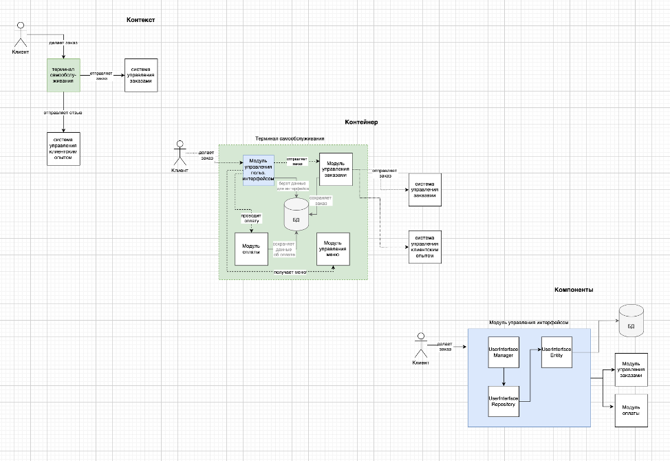
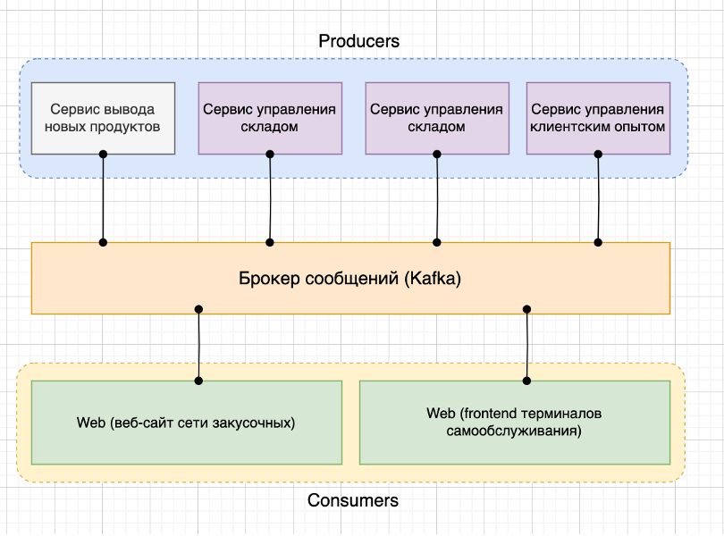
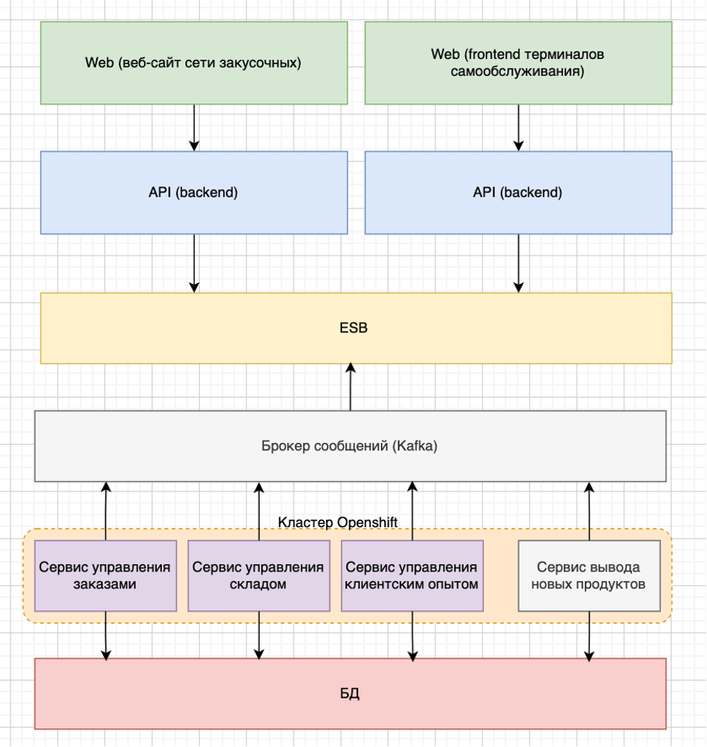

= Проект по разработке системы внедрения новых продуктов в сети столовых "Замысловатость"

== Общая информация
Проект представляет собой разработку и вывод в эксплуатацию нового сервиса по внедрению новых продуктов в IT-систему межгалактических закусочных "Замысловатость".

== Цели внедрения проекта

. Увеличить скорость внедрение нового продукта в сеть закусочных, тем самым сократив вывод нового продукта на рынок.
. Обеспечить удобство использования нового сервиса, так как удобство существующей системы категорически не удовлетворяет пользователей. 

== Описание проекта

//Пример маркированного списка
* ключевая задача проекта - разработать и вывести в эксплуатацию сервис внедрения новых продуктов,
* выбранная ИТ-медология - scrum, так как вся системя существует на микросервисах и поделена между небольших командами, кроме того, до конца не определены и не зафиксированы требования к сервису. 
* управление проектом будет осуществляться в Jira, ведение документации в Confluence, 
* ссылка на проект - link:https://github.com/lunaresmare/DocAsCode_Otus[Сервис внедрения новых продуктов]

== Roadmap проекта

image::diagrams/Roadmap.png[Roadmap проекта]

== Команда проекта

.Команда проекта
[cols="2*",options="header"]  
|=== 
|Должность|Количество
|Team Lead системных аналитиков|1
|Системный аналитик|2
|BE Разработчик|2
|FE Разработчик|2
|Тестировщик|3
|===

== Риски проекта

В данном разделе привести анализ и план-структуру возможных рисков.

_Это ДЗ на курсе не делала._

== Описание выбранного решения

Сервис внедрения новых продуктов представляет из себя программный модуль с реализацией бизнес-логики (backend), а также компонент с реализацией пользовательского интерфейса (frontend). 

В качестве хранилища был выбран PostgreSQL, как уже используемое в других микросервисах решение.

Для обмена информацией с другими сервисами было принято решение использовать брокер сообщений Kafka. Выбор данного брокера продиктован также нефункциональными требованиями к продукту, а именно требованием к целостности и доступности данных. 

Для ознакомления с решением предлагается диаграмма C4.

*C4*

== Описание архитектуры с НФТ

С учетом выбранного технологического стека архитектура решения была проработана в паттерне EDA и SOA. 

*EDA*

  

*SOA*

  

В связи с решением о применении в организации ISO/IEC 27001 для безопасности данных было принято решение реализовать применение НФТ в сервисе с наиболее чувствительными данными - сервисе "Система внедрения новых продуктов"

.Нефункциональные требования
[options="header"]
|===
|Требование |Атрибут 
|Доступность | Система должна демонстрировать уровень доступности, при котором допустимое время простоя: не более 5 мин в час, не более 10 часов в месяц
|Надежность	| Система должна иметь время восстановления не больше двух часов
|Производительность	| Одноврменная работа до 15 сотрудников за час
|Масштабируемость	| Система должна поддерживать увеличение производительности за счет увеличения вычислительной мощности оборудования. При этом пятикратное увеличение производительности не должно превышать 100% от стоимости эксплуатации на момент сдачи
|Удобство использования	|  Дизайн интерфейса системы должен позволять сотруднику управления закупками заполнить информацию сразу по нескольким продуктам, переключаясь из одной вкладки в другую
|Целостность данных	|  Данные должны быть целостны и доступны в любой момент времени
|===

== Заключение

Реализация этого проекта позволит увеличить time to market нового продукта в 5 раз, а также повысит удовлетворенность сотрудников, отвечающих за процесс внедрения нового продукта в существующие процессы.